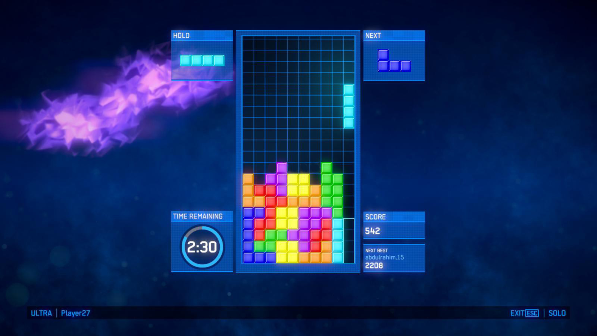

# 程序设计 Project 2

该项目要求在 Project 1 的基础上为俄罗斯方块增加图形界面，进一步提高用户交互的友好性

我们将 Project2 中需要实现的内容分为逻辑和界面。在 Project 1 中，同学们基本上已经完成了大部分的逻辑操作，这次只需要对一部分原来没有实现和对未完善的部分进行完善，着重重构代码和使用面向对象设计的部分。图形化界面推荐大家多多参考网上优秀的界面设计案例。一个美观的界面可以在面试中获得许多加分


# 基础功能部分

## 代码风格
在 Project 2 ，我们对代码风格有了**更严格**的要求，具体内容如下：

+ 单个方法的长度不应超过 200 行。（如有特殊情况可向助教提出）
+ 方法名和变量名命名得当，必须按照驼峰法命名
+ 方法和类的作用与意义清晰明确
+ 将代码逻辑和界面设计部分的代码分开


## 面向对象设计
使用面向对象的思想来设计代码结构是 Project 2 的重点要求。在同学们动手写代码之前，助教建议同学们根据所学知识，设计好基础功能的每个类。

对作图有需求者可以尝试Process On这个作图工具，以方便梳理PJ中各个类之间的关系：
[https://www.processon.com/](https://www.processon.com/)


## 文档

此次PJ对文档内容作出如下要求：

1. 用户界面的使用说明，内容包括各个按钮的功能，游戏操作指南等

2. 自己设计的**逻辑部分**中每个类的功能与分工。内容包括但不限于：

    + 类名、类的意义和作用
    + 类的父类、子类和接口，以及这么设计的理由（如果有）
    + 类的构造函数、public方法以及它们的作用。（要求体现封装的概念）
    + 类的私有变量及其作用。（可以只列出关键的几个）
    + 其他有必要提及的内容，比如和其他某个类之间的联系

3. 程序开发过程中遇到的问题以及解决办法或心得体会


## 图形界面


图形界面是 Project 2 的重点，也是最有趣的部分。关于这部分同学们可以自己发挥想象，设计出尽可能完备美观的界面。

需要各种素材以及灵感来源的同学可以参考以下网站：

+ [设计师网址导航](https://hao.uisdc.com/)

+ [在知乎上搜索问题](https://www.zhihu.com/)

可以得满分的图形界面设计如下图所示：



基本游戏界面包括但不限于以下内容:

 + 一个10 * 20容量的方格空间，空间中包含**已经下落**的方块
 + 当前要下落的方块（HOLD）
 + 下次要下落的方块（NEXT）
 + 分数显示栏
 + 排行榜入口（按钮）以及排行榜界面
 + 背景音乐与音效的开、关按钮
 + 使用小道具的按钮
 + 重新开始按钮
 + 退出按钮

图形界面要求用户体验良好，尽量不要出现过于繁杂的操作逻辑


## 音效与背景音乐

### 背景音乐
游戏要求加入背景音乐（背景音乐曲目种类和数量由同学根据自己的喜好选择），在游戏中可以**循环播放**，在界面上提供开启与关闭的切换按钮

### 音效
在方块旋转、快速下落（空格键）、消除行时要求播放音效，音效资源自行选定


## 游戏操作
游戏涉及到的方块类型如下：


>
> 注意：在PJ2中，我们要求每种方块具有不同的颜色
>


本次Project**仍然不强制要求**方块自动下落，只需要能够改变方块朝向和下落位置即可。操作逻辑如下：

+ 游戏过程监听键盘事件，并按照如下设定执行操作：

    |按键名称|执行操作|
    |:-:|:-|
    |```左方向键```|将当前要下落的方块左移一格|
    |```右方向键```|将当前要下落的方块右移一格|
    |```下方向键```|将当前要下落的方块下移一格|
    |```上方向键```|将当前要下落的方块顺时针旋转90度|
    |```空格```|使当前要下落的方块直接下落|

+ 每次方块下落后自动消除填满的方格行


## 游戏分数
游戏分数分为两部分：

+ 基础分数，用户每消除一行，加10分
+ 减扣分数，游戏过程时，每次方块下落后**实时**统计方格中“孔洞”（即由方块或空间边界构成的空隙）的数量，每出现一个“孔洞”扣1分，若后期该“孔洞”被填满或消除，则之前由该“孔洞”造成的扣分失效


## 结束判定
当方格空间中方块最高处达到空间顶端（即>=20)时，游戏结束，此时弹出提示要求用户输入名字，将用户的名字与分数一同计入到排行榜中。**此时不再接受方块移动或下落的指令**，直到用户手动点击重新开始按钮。


## 排行榜
每次游戏结束后将分数纳入排行榜，在游戏中可随时打开排行榜，将姓名、分数按照分数由高到低的顺序排列显示出来。

此外，排行榜要求实现持久化，即将排行榜数据记录到文件中，下次打开游戏时仍能看到上次的排行榜记录


## 小道具

+ 消除道具，消除最底部一行方块（此次消除不计入游戏分数）

+ 随机道具，将当前要下落的方块替换为随机的另一个方块

每次（重新）开始游戏时，给予用户5个消除道具与10个随机道具


>
>注：上述功能是基础功能点，全部完成即可得到代码部分的满分。若完成了附加功能则可以在未达到满分的情况下给予加分
>


# 附加功能部分

## 方块自动下落
每隔1s自动将当前方块自动下落一格

## 图形界面可变换风格
界面上提供“换肤”按钮，可随意切换界面风格

## 极度奢华的特效
此部分可自行发挥，这里给出几个例子：

+ 方块发光，发光颜色与方块颜色相同
+ 方块旋转、下落、移动时有动画过渡效果


## 项目评分

### 基础功能点

|功能点描述|分数|
|:-|:-:|
|代码风格良好|5|
|符合面向对象设计原则|5|
|图形界面美观，用户体验良好|10|
|每种方块具有不同的颜色|5|
|背景音乐与音效|5|
|方块正确下落，不与其他方块重叠|5|
|方块旋转方向无误，不发生错位|5|
|正确监听键盘按键事件|5|
|游戏得分计算|10|
|小道具功能|5|
|排行榜显示正确，实现持久化|10|
|游戏运行总体正常，符合相关描述，不会异常退出|5|
|总计|75|


### 综合评价部分

|描述|分数|
|:-|:-:|
|设计文档（包括但不限于程序结构设计与分析，主要类与方法的功能，简要描述如何使用你的程序，编程中遇到的问题和解决策略）|15|
|面试总评（能否清晰地解释程序结构，能否回答助教的问题等）|10|
|总分|25|


### 附加功能部分

|描述|分数|
|:-|:-:|
|自动下落|15|
|图形界面可变换风格|5|
|极度奢华的特效|10|


## 项目提交与面试

### 提交截止时间
本次课程项目提交截止时间为 **2019 年 1 月 4 日 23:59**。

建议同学们在截止时间前一周就将项目基本完成，以防来不及完成，或者来不及修正突然发现的 bug 。

### 提交方式
请提交源代码、文档。源代码应以项目的形式提交。如有必要可以提交其他材料。

在截止时间之前将提交材料压缩并上传到：

```
ftp://10.142.141.33/classes/18/181  程序设计A（陈荣华）/WORK_UPLOAD/Project2
```

压缩包请重命名为：```学号_姓名.zip```

如果发现之前提交的文件有问题，可以重新上传压缩包。ftp不允许删除或者覆盖文件，需要上传一个新的压缩包，命名格式为：```学号_姓名_第n次上传.zip```

### 迟交惩罚
每迟交一天，最终得分扣除20%。

如：1月5日 00:01 AM 提交，扣除20%，1月7日 11:30 PM 提交，扣除60%。

>
>注：如果提交多次，以面试时选择的提交文件的提交时间为准。评分亦以此文件为准。
>

### 面试注意事项
本次课程项目面试时间为2019年1月5日 10:00开始，地点为机房，即Lab课组织面试。如有调整会提前通知

原则上面试时不允许现场Debug，请确保你的程序能正常运行

### 抄袭惩罚

**严禁任何形式的抄袭。**

助教将检查每个同学的代码、文档等材料，如有发现抄袭现象，将严肃处理。

抄袭同学零分处理。被抄袭同学将视情况作出惩罚。
